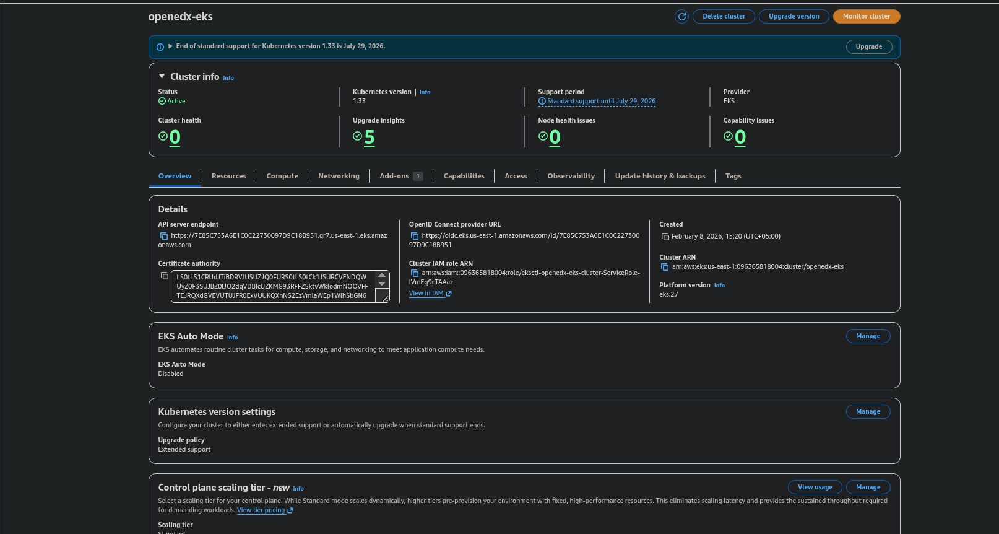
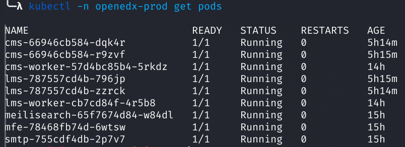
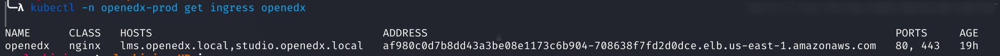
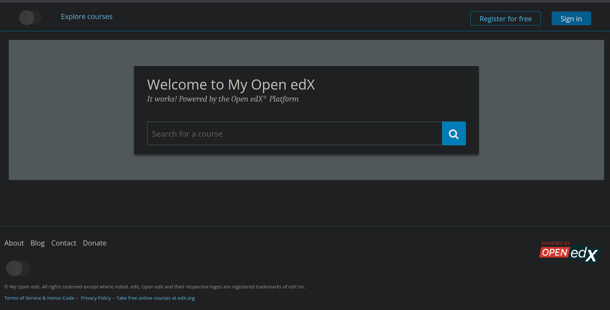
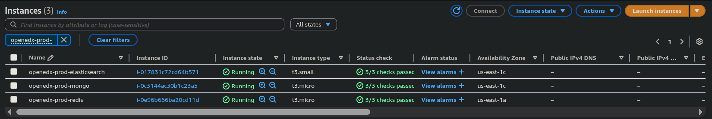
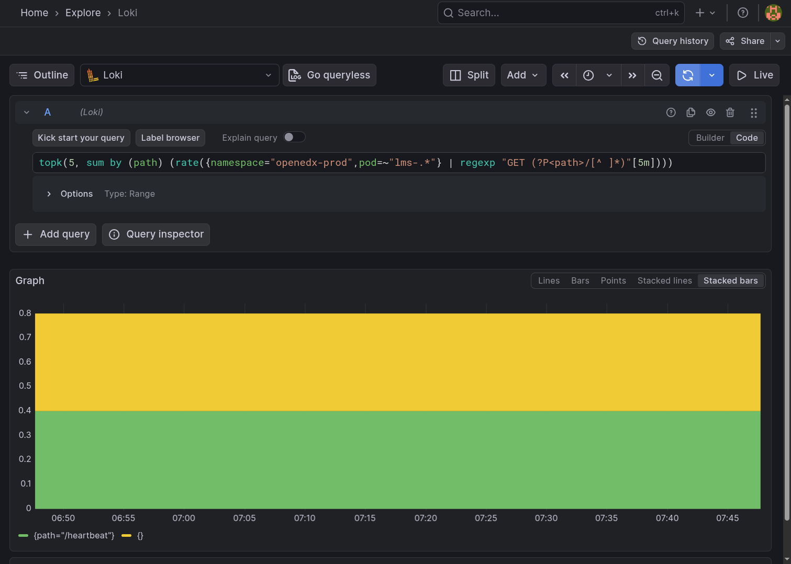
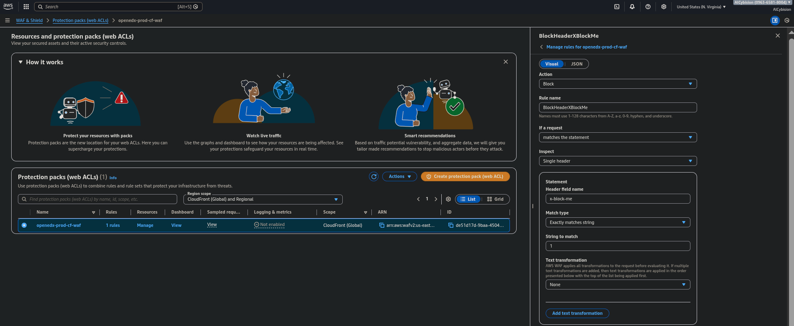
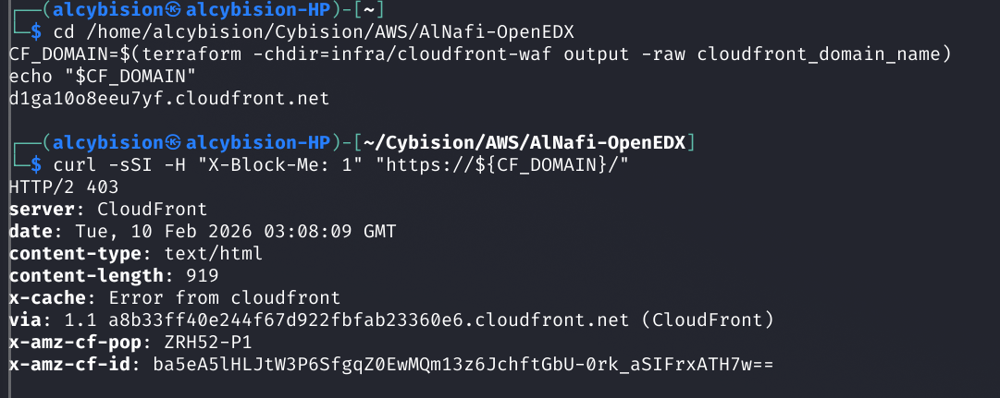

# AlNafi OpenEdX on AWS EKS — Technical Assessment

This repository contains the infrastructure, configuration, and documentation for deploying Open edX on AWS EKS with external data services, NGINX ingress, observability, and CloudFront + WAF.

Strict data-layer rule: no databases run inside Kubernetes (Tutor's optional Meilisearch is disabled; MySQL/Mongo/Redis/Elasticsearch are external and private-only).

## Documentation

- `AGENTS.md` (agent/human operating guide: what/why/where/how/when)
- `docs/README.md`
- External references (upstream docs): `docs/references.md`
- Research summary (upstream best practices): `docs/upstream-guidance.md`
- Reproduction runbook: `docs/reproduce.md`
- Operator smoke test (post-deploy verification): `docs/smoke-test.md`
- Optional: cluster automation: `infra/eksctl/`
- Configuration artifacts index: `docs/config-artifacts.md`

## Key Artifacts

- Tutor config (sanitized): `data-layer/tutor/config/config.yml.sanitized`
- ingress-nginx Helm values: `infra/ingress-nginx/values.yaml`
- Media PV/PVC (EFS RWX): `infra/k8s/02-storage/openedx-media-efs.yaml`
- Tutor apply wrapper (Caddy removal + probes + media mount): `infra/k8s/04-tutor-apply/apply.sh`

## Step-by-Step Deployment Guide

Primary runbook (script-driven):
- `docs/reproduce.md`

## Known Limitations (Assessment Setup)

- Domains are placeholders: `lms.openedx.local`, `studio.openedx.local` (no real DNS).
- TLS uses a self-signed certificate for these placeholder domains (satisfies “TLS termination at NGINX” for the assessment).
- CloudFront default domain requests may return 404 because NGINX routes by `Host`. The WAF proof (HTTP/2 403 with `X-Block-Me: 1`) is independent of host routing.
- EKS API endpoint is public for reproducibility; a real production environment should restrict CIDRs or use private endpoint access.

## Repo Hygiene (Security)

- Terraform state/plan files (for example `infra/**/terraform.tfstate`, `infra/**/tfplan`) are generated locally and contain secrets. They are `.gitignore`'d; do not commit or share a raw folder copy. Use `git clone` of the repo for sharing.

High-level execution order:
1. (Optional) Create EKS cluster: `infra/eksctl/create-cluster.sh`
2. Core add-ons (EBS CSI + `gp3` default + metrics-server): `infra/eksctl/install-core-addons.sh`
3. Namespaces: `kubectl apply -f k8s/00-namespaces/namespaces.yaml`
4. NGINX ingress controller: `infra/ingress-nginx/install.sh`
5. (Optional) cert-manager (real domains + Let's Encrypt TLS): `infra/cert-manager/install.sh`
6. External data layer (RDS + EC2 DBs): `infra/terraform/apply.sh`
7. Shared media (EFS RWX) + PVC: `infra/media-efs/apply.sh` then `infra/k8s/02-storage/apply.sh`
8. Tutor/Open edX deploy: follow `docs/tutor-k8s.md` then apply with `infra/k8s/04-tutor-apply/apply.sh`
9. Ingress rules + TLS secret: `k8s/03-ingress/create-selfsigned-tls.sh` then `kubectl apply -f k8s/03-ingress/openedx-ingress.yaml`
10. HPA + k6 load test: `infra/k8s/05-hpa/apply.sh` then follow `docs/hpa-loadtest.md`
11. Observability (Prometheus/Grafana + Loki): `infra/observability/install.sh`
12. CloudFront + WAF: `infra/cloudfront-waf/apply.sh` and `infra/cloudfront-waf/verify.sh`

## Evidence Pack

Screenshots are committed in `docs/screenshots/`.

### 1) EKS Cluster Proof
- Screenshot: EKS cluster overview (openedx-eks, Status ACTIVE)
- File: `docs/screenshots/eks-cluster-active.png`


### 2) OpenEdX Running (Pods + Ingress)
Commands:
```bash
kubectl -n openedx-prod get pods
kubectl -n openedx-prod get ingress openedx
kubectl -n openedx-prod get svc mfe -o wide
```
Screenshots:
- `docs/screenshots/openedx-pods.png`
- `docs/screenshots/openedx-ingress.png`
- `docs/screenshots/mfe-service-clusterip.png` (`mfe` type is `ClusterIP`)
- `docs/screenshots/OpenEdxLMS.png` (browser: LMS UI loaded)





### 3) External Data Layer Proof
Screenshots:
- RDS instance details (endpoint + private networking / not public)
  - `docs/screenshots/rds-private-endpoint.png`
- EC2 instances list (mongo/redis/es private IPs, no public IPv4)
  - `docs/screenshots/ec2-private-ips.png`



Terminal proof (no secrets printed):
```bash
RDS_ENDPOINT=$(terraform -chdir=infra/terraform output -raw rds_endpoint)
MONGO_IP=$(terraform -chdir=infra/terraform output -raw mongo_private_ip)
REDIS_IP=$(terraform -chdir=infra/terraform output -raw redis_private_ip)
ES_IP=$(terraform -chdir=infra/terraform output -raw elasticsearch_private_ip)

kubectl -n openedx-prod run verify-net --image=alpine:3.20 --restart=Never \
  --command -- sh -c "apk add --no-cache busybox-extras curl >/dev/null; \
  getent hosts ${RDS_ENDPOINT} || true; \
  nc -vz ${RDS_ENDPOINT} 3306; \
  nc -vz ${MONGO_IP} 27017; \
  nc -vz ${REDIS_IP} 6379; \
  nc -vz ${ES_IP} 9200; \
  curl -sS http://${ES_IP}:9200/ | head -n 50"

kubectl -n openedx-prod logs verify-net
kubectl -n openedx-prod delete pod verify-net --ignore-not-found
```

Captured output (from `kubectl -n openedx-prod logs verify-net`, 2026-02-10):
```text
openedx-prod-mysql.c0348w0sgvja.us-east-1.rds.amazonaws.com (192.168.112.236:3306) open
192.168.88.164 (192.168.88.164:27017) open
192.168.101.224 (192.168.101.224:6379) open
192.168.77.200 (192.168.77.200:9200) open
{
  "name" : "openedx-prod-es-1",
  "cluster_name" : "openedx-prod-es"
}
```

### 3b) Studio Course Creation + Mongo Persistence + Pod Restart
Create a course in Studio (`https://studio.openedx.local`), then verify Mongo collections and post-restart persistence.

Mongo verification command (no secrets printed):
```bash
kubectl -n openedx-prod exec deploy/lms -- bash -lc 'cd /openedx/edx-platform && \
python manage.py lms shell --no-imports --command "\
import re; \
from django.conf import settings; \
from pymongo import MongoClient; \
conf=settings.CONTENTSTORE[\"DOC_STORE_CONFIG\"]; \
client=MongoClient(conf[\"host\"], int(conf.get(\"port\", 27017)), \
  username=conf.get(\"user\"), password=conf.get(\"password\"), \
  authSource=conf.get(\"authsource\") or conf.get(\"db\") or \"admin\", \
  tls=bool(conf.get(\"ssl\", False))); \
db=client[conf[\"db\"]]; \
names=[n for n in db.list_collection_names() if re.search(r\"modulestore|course\", n, re.I)]; \
print(names[:20])"'
```

Restart and persistence check:
```bash
kubectl -n openedx-prod rollout restart deploy/lms deploy/cms
kubectl -n openedx-prod rollout status deploy/lms --timeout=10m
kubectl -n openedx-prod rollout status deploy/cms --timeout=10m
```

Screenshots:
- `docs/screenshots/studio-course-created.png`
- `docs/screenshots/mongo-course-persistence.png`
- `docs/screenshots/course-persistence-after-restart.png`

### 4) HPA Scaling Proof
Pre-step (required for reproducible HPA metrics and rollout):
```bash
infra/k8s/05-hpa/apply.sh
kubectl top nodes
```

Generate load (k6):
```bash
kubectl -n openedx-prod create configmap k6-script \
  --from-file=loadtest-k6.js=infra/k8s/05-hpa/loadtest-k6.js \
  --dry-run=client -o yaml | kubectl apply -f -

kubectl -n openedx-prod delete job k6-loadtest --ignore-not-found

cat <<'YAML' | kubectl apply -f -
apiVersion: batch/v1
kind: Job
metadata:
  name: k6-loadtest
  namespace: openedx-prod
spec:
  backoffLimit: 0
  ttlSecondsAfterFinished: 600
  template:
    spec:
      restartPolicy: Never
      containers:
        - name: k6
          image: grafana/k6:0.49.0
          args: ["run", "--vus", "120", "--duration", "5m", "/scripts/loadtest-k6.js"]
          volumeMounts:
            - name: scripts
              mountPath: /scripts
      volumes:
        - name: scripts
          configMap:
            name: k6-script
YAML
```

Watch scaling:
```bash
kubectl -n openedx-prod get hpa -w
```

Command:
```bash
kubectl -n openedx-prod get hpa
```
Screenshot:
- `docs/screenshots/hpa-scaling.png`


Optional:
```bash
kubectl -n openedx-prod get deploy lms -w
```
This is optional evidence only and is not required for the minimum checklist.

### 5) Grafana Dashboard
Commands (do not screenshot password output):
```bash
kubectl -n observability get secret kube-prometheus-stack-grafana \
  -o jsonpath="{.data.admin-password}" | base64 -d ; echo

kubectl -n observability port-forward svc/kube-prometheus-stack-grafana 3000:80
```

Screenshot:
- `docs/screenshots/grafana-dashboard.png`


### 6) Central Logs (Loki)
Grafana Explore:
- Datasource: `Loki`
- Query (graph, from `lms` logs): `topk(5, sum by (path) (rate({namespace="openedx-prod", pod=~"lms-.*"} | regexp "GET (?P<path>/[^ ]*)"[5m])))`
- Raw logs query (optional): `{namespace="openedx-prod", pod=~"lms-.*"}`
- If Explore shows `React Monaco Editor failed to load`, switch from `Code` to `Builder`.

Screenshot:
- `docs/screenshots/loki-logs.png`


### 7) CloudFront + WAF
Screenshots:
- CloudFront distribution details: `docs/screenshots/cloudfront-details.png`
- WAF WebACL + rule: `docs/screenshots/waf-webacl.png`



Terminal proof of block:
```bash
CF_DOMAIN=$(terraform -chdir=infra/cloudfront-waf output -raw cloudfront_domain_name)

curl -sSI -H "X-Block-Me: 1" "https://${CF_DOMAIN}/"
```
Screenshot:
- `docs/screenshots/waf-block-403.png`


---

For the full ordered checklist, see `docs/evidence-checklist.md`.
