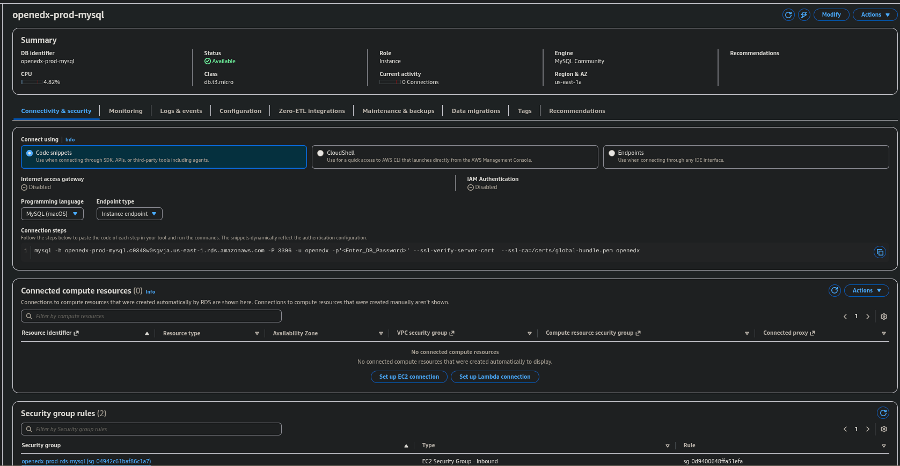
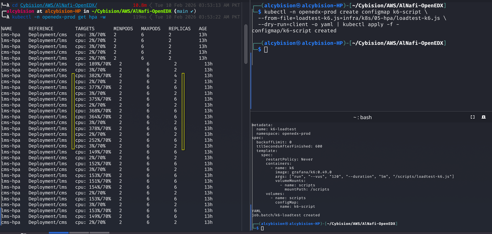
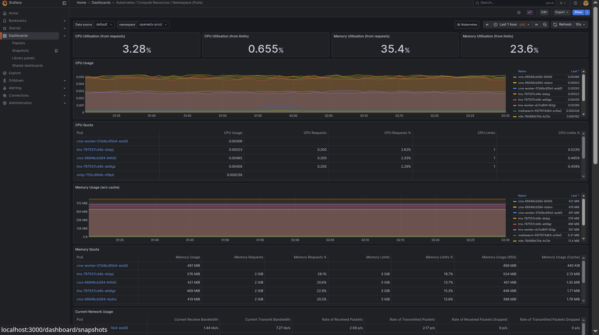
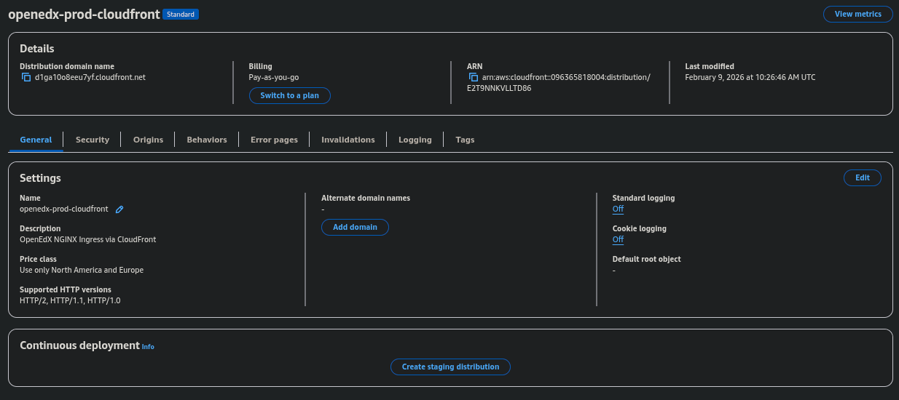

# Open edX on AWS EKS (Assessment Submission)

This repository deploys a production-style Open edX platform on AWS EKS with external data services, ingress-based routing, autoscaling, observability, and edge security.

## Scope

- AWS region: `us-east-1`
- Kubernetes: Amazon EKS
- Open edX via Tutor + tutor-k8s
- Edge ingress: NGINX ingress controller (Tutor edge Caddy removed)
- External data layer (outside Kubernetes):
  - MySQL on Amazon RDS
  - MongoDB on EC2
  - Redis on EC2
  - Elasticsearch on EC2
- TLS: cert-manager + Let's Encrypt (real-domain path)
- HPA: LMS + CMS
- Observability: Prometheus/Grafana + Loki
- CDN/WAF: CloudFront + AWS WAF

## Repository Layout

```text
.
├── README.md
├── scripts/                 # All operator scripts (canonical entrypoints)
├── configs/                 # Terraform, Kubernetes, ingress, observability, tutor artifacts
├── docs/
│   ├── reproduce.md         # Step-by-step runbook
│   └── rationale.md         # Architecture + decisions + troubleshooting appendix
└── evidence/
    └── screenshots/         # Mandatory proof screenshots
```

## Operator Interface

Use `scripts/openedxctl` for all major actions:

```bash
scripts/openedxctl deploy
scripts/openedxctl verify
scripts/openedxctl demo-gate
scripts/openedxctl pause
scripts/openedxctl resume
```

Additional commands:

```bash
scripts/openedxctl destroy
scripts/openedxctl phase <number>
```

## Compatibility Layer

Legacy paths under `infra/...` and `k8s/...` are kept as wrappers for one compatibility cycle and forward to `scripts/...`.

## Reproduction Guide

Full reproducible process:

- `docs/reproduce.md`
- `docs/demo-checklist.md`

Architecture decisions and implementation rationale:

- `docs/rationale.md`

## Evidence (Mandatory Files)

- `evidence/screenshots/eks-cluster-active.png`
- `evidence/screenshots/openedx-pods.png`
- `evidence/screenshots/openedx-ingress.png`
- `evidence/screenshots/rds-private-endpoint.png`
- `evidence/screenshots/ec2-private-ips.png`
- `evidence/screenshots/hpa-scaling.png`
- `evidence/screenshots/grafana-dashboard.png`
- `evidence/screenshots/loki-logs.png`
- `evidence/screenshots/cloudfront-details.png`
- `evidence/screenshots/waf-webacl.png`
- `evidence/screenshots/waf-block-403.png`

### Embedded Proof










## Demo Checklist (Live Review)

Single-command demo readiness gate:

```bash
cp -n configs/demo/demo.env.example .env.demo.local
# edit .env.demo.local
scripts/openedxctl demo-gate --skip-backup
```

Artifacts:

```text
artifacts/demo-gate/<UTC_TS>/{summary.md,raw.log,json-summary.json}
```

Core command set (manual view):

```bash
kubectl -n openedx-prod get pods
kubectl -n openedx-prod get ingress openedx
kubectl -n openedx-prod get hpa
terraform -chdir=configs/terraform/data-layer output
scripts/53-cloudfront-waf-verify.sh
```

Browser endpoints:

- `https://lms.<your-domain>`
- `https://studio.<your-domain>`
- `https://apps.lms.<your-domain>/authn/login`
