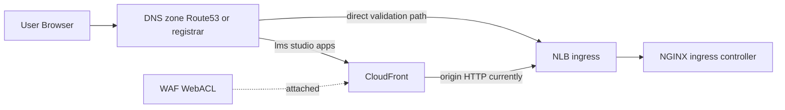
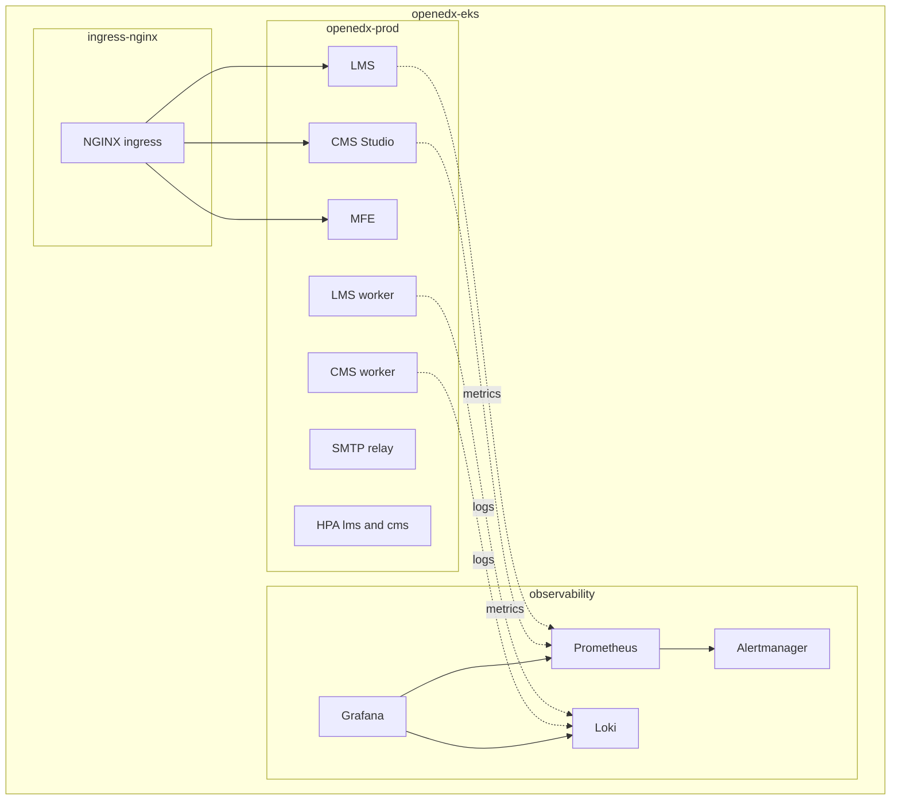
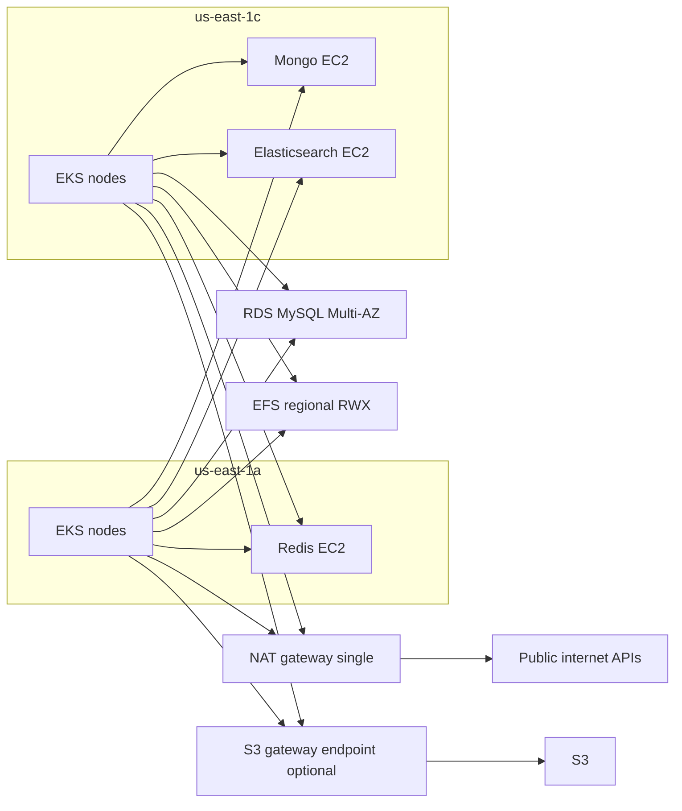

# Architecture & Network Flow

This document describes the deployed topology, request flow, and operational boundaries.

## Scope

- Region: `us-east-1`
- EKS cluster: `openedx-eks`
- Namespaces:
  - `openedx-prod` (Open edX workloads)
  - `ingress-nginx` (ingress controller)
  - `observability` (Prometheus/Grafana/Loki)
- Public hostnames (production path):
  - `lms.<domain>`
  - `studio.<domain>`
  - `apps.lms.<domain>`
- Databases are external to Kubernetes and private-only:
  - RDS MySQL
  - EC2 MongoDB
  - EC2 Redis
  - EC2 Elasticsearch

## Components

Edge:
- Authoritative DNS zone (Route53 or external registrar DNS) for `lms/studio/apps` records
- CloudFront + WAF (edge security path)
- NLB from ingress-nginx `LoadBalancer` service
- NGINX Ingress Controller (TLS termination for direct ingress path)

Application (`openedx-prod`):
- `lms`, `cms`, `mfe`, `lms-worker`, `cms-worker`, `smtp`
- HPA on `lms` and `cms`

Storage/Data:
- EFS RWX PVC for `/openedx/media`
- External MySQL/Mongo/Redis/Elasticsearch

Observability:
- kube-prometheus-stack (Prometheus, Alertmanager, Grafana)
- Loki stack

## Diagram 1: Edge & DNS Flow

TLS note:
- Viewer TLS: browser to CloudFront, and browser to NLB/NGINX on direct ingress path.
- Origin TLS (CloudFront to NGINX) is currently `http-only` by design in this repo and can be hardened to `https-only` once origin hostname/certificate alignment is in place.

## Diagram 2: Kubernetes Runtime Flow

## Diagram 3: Data, AZ, and Egress View

## Ports and Access Matrix

| From | To | Port | Purpose |
|---|---|---:|---|
| Internet | CloudFront | 443 | viewer traffic |
| CloudFront | NLB | 80 | origin path (current setting) |
| Internet | NLB | 443 | direct ingress validation path |
| NGINX Ingress | LMS/CMS services | 8000 | app routing |
| Open edX pods | RDS MySQL | 3306 | relational DB |
| Open edX pods | MongoDB | 27017 | modulestore/content data |
| Open edX pods | Redis | 6379 | cache/broker |
| Open edX pods | Elasticsearch | 9200 | search backend |
| EKS nodes | EFS mount targets | 2049 | shared media RWX |

## Current Hardening Status

Production-style and implemented:
- Real domain routing
- Let’s Encrypt certificates via cert-manager
- NGINX ingress replacing edge Caddy
- EKS endpoint hardening (private access enabled + public access CIDR restricted)
- External data layer outside Kubernetes
- RDS Multi-AZ
- HPA/probes/observability/backups

Still not fully enterprise-hard (known gaps):
- Mongo/Redis/Elasticsearch are single EC2 instances
- CloudFront origin protocol currently `http-only`
- NAT is single gateway (not highly available)

## Hardening Path (if required)

1. Increase RDS backup retention and automate restore drills.
2. Move Redis/Elasticsearch to managed multi-AZ services if allowed, or add replication/failover on EC2.
3. Move CloudFront origin to `https-only` with certificate-hostname alignment.
4. Use multi-NAT design for AZ fault tolerance.
