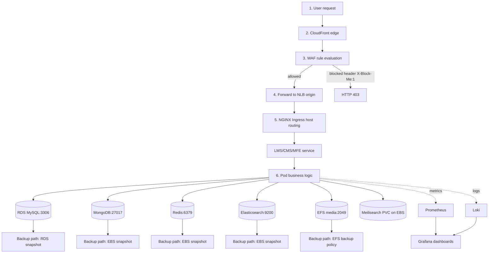

# Architecture & Network Flow

This document explains what is deployed, where it runs (AWS/Kubernetes), and how traffic/data flows through the system.

## Scope

- Region: `us-east-1`
- EKS cluster: `openedx-eks`
- Kubernetes namespaces:
- `openedx-prod` (Open edX workloads)
- `ingress-nginx` (NGINX Ingress Controller)
- `observability` (Prometheus/Grafana + Loki)
- Domains (placeholders for assessment): `lms.openedx.local`, `studio.openedx.local`, `apps.lms.openedx.local`
- Databases are external to Kubernetes (RDS + EC2), private only.

## Components (By Layer)

Edge + security:
- AWS WAF attached to CloudFront (header-based block rule for proof)
- CloudFront distribution (origin: the ingress NLB)
- AWS NLB created by `ingress-nginx` Service type `LoadBalancer`
- NGINX Ingress Controller terminates TLS (direct ingress access) and routes to services

Application (EKS pods in `openedx-prod`):
- LMS deployment + service
- CMS (Studio) deployment + service
- LMS/CMS workers (Celery) deployments
- MFE deployment + service
- SMTP deployment + service

Data layer (external to Kubernetes, private only):
- RDS MySQL 8.0.x (Open edX relational DB)
- MongoDB (EC2) for Open edX document store
- Redis (EC2) for cache/broker
- Elasticsearch (EC2) for search backend (enabled via Tutor plugin)

Storage:
- EFS (RWX) for shared media/uploads mounted into LMS/CMS at `/openedx/media`
- EBS gp3 (RWO) for single-writer PVCs (Meilisearch)

Observability:
- kube-prometheus-stack (Prometheus, Grafana, Alertmanager)
- Loki + Promtail (cluster log collection)

Backups:
- RDS snapshots (manual)
- EC2 EBS snapshots (manual)
- EBS-backed PV snapshots (manual)
- EFS media: AWS Backup / EFS backup policy (documented)

## Kubernetes Layout (What Runs Where)

`ingress-nginx`:
- Deployment: `ingress-nginx-controller` (replicas=2)
- Service: `ingress-nginx-controller` (type `LoadBalancer` -> NLB)

`openedx-prod`:
- Deployments: `lms`, `cms`, `lms-worker`, `cms-worker`, `mfe`, `smtp`, `meilisearch`
- Ingress: `openedx` (hosts `lms.openedx.local`, `studio.openedx.local`, `apps.lms.openedx.local`)
- HPA: `lms-hpa`, `cms-hpa` (min=2, max=6, CPU target 70%)
- PVC: `openedx-media` (RWX, EFS) and `meilisearch` (RWO, EBS gp3)

`observability`:
- Helm releases: `kube-prometheus-stack`, `loki-stack`
- Grafana includes Prometheus + Loki data sources (Loki auto-provisioned)

## Network + Security Model

Subnets:
- NLB runs in public subnets (created/managed by AWS)
- EKS worker nodes run in private subnets
- EC2 DB instances + RDS run in private subnets

Security groups (SG) intent:
- DB SGs do not allow public access and only allow inbound from the EKS worker node SG
- EFS SG allows NFS (2049/tcp) inbound from the EKS worker node SG

Ports (high-level):
- Internet -> CloudFront: 443
- CloudFront -> NLB: 80 (HTTP to origin, assessment-mode)
- NGINX -> LMS/CMS services: 8000/tcp
- Pods -> RDS MySQL: 3306/tcp
- Pods -> MongoDB: 27017/tcp
- Pods -> Redis: 6379/tcp
- Pods -> Elasticsearch: 9200/tcp
- Pods -> EFS mount targets: 2049/tcp

## Ports and Access Matrix

This table summarizes the minimum required network paths for the deployment.

| From | To | Port | Why |
|---|---|---:|---|
| Internet | CloudFront | 443 | public entrypoint |
| CloudFront | NLB (ingress-nginx) | 80 | edge to origin (HTTP, assessment-mode) |
| NLB | NGINX Ingress Controller pods | 443/80 | TLS termination + routing |
| NGINX Ingress | LMS/CMS services | 8000 | app traffic |
| LMS/CMS/Workers pods | RDS MySQL | 3306 | relational DB |
| LMS/CMS/Workers pods | MongoDB EC2 | 27017 | document store |
| LMS/CMS/Workers pods | Redis EC2 | 6379 | cache/broker |
| LMS/CMS pods | Elasticsearch EC2 | 9200 | search |
| EKS worker nodes | EFS mount targets | 2049 | RWX media/uploads |

Security note:
- DB/EFS resources are private and SG-restricted so only the EKS worker SG can initiate traffic to these ports.

## Architecture Diagram

```mermaid
flowchart LR
  USER[User / Browser]
  WAF[AWS WAF]
  CF[CloudFront]
  NLB[AWS NLB (ingress-nginx Service)]

  USER --> CF
  WAF -. attached to .-> CF
  USER -. direct validation path .-> NLB
  CF --> NLB

  subgraph VPC[VPC (us-east-1)]
    direction LR

    subgraph PUB[Public subnets]
      NLB
    end

    subgraph PRIV[Private subnets]
      direction LR

      subgraph EKS[EKS Cluster: openedx-eks]
        direction TB

        subgraph INGRESS[Namespace: ingress-nginx]
          NGX[NGINX Ingress Controller]
        end

        subgraph APP[Namespace: openedx-prod]
          LMS[LMS]
          CMS[CMS / Studio]
          MFE[MFE]
          LMSW[LMS Worker]
          CMSW[CMS Worker]
          SMTP[SMTP]
          MEILI[Meilisearch]
          HPA[HPA lms/cms]
        end

        subgraph OBS[Namespace: observability]
          PROM[Prometheus]
          GRAF[Grafana]
          LOKI[Loki]
          ALERT[Alertmanager]
        end
      end

      subgraph DATA[External data layer (outside Kubernetes, private)]
        RDS[(RDS MySQL 8.0)]
        MONGO[(MongoDB EC2)]
        REDIS[(Redis EC2)]
        ES[(Elasticsearch EC2)]
      end

      subgraph STORAGE[Storage layer]
        EFS[(EFS RWX openedx-media)]
        EBS[(EBS gp3 RWO meilisearch)]
      end
    end
  end

  NLB --> NGX
  NGX --> LMS
  NGX --> CMS
  NGX --> MFE

  LMS --> RDS
  LMS --> MONGO
  LMS --> REDIS
  LMS --> ES
  LMSW --> REDIS
  LMSW --> RDS
  LMSW --> MONGO
  CMS --> RDS
  CMS --> MONGO
  CMS --> REDIS
  CMS --> ES
  CMSW --> REDIS
  CMSW --> RDS
  CMSW --> MONGO

  LMS --> EFS
  CMS --> EFS
  MEILI --> EBS

  LMS -. metrics/logs .-> PROM
  CMS -. metrics/logs .-> PROM
  LMSW -. logs .-> LOKI
  CMSW -. logs .-> LOKI
  GRAF --> PROM
  GRAF --> LOKI
  PROM --> ALERT
```

## Network Flow Diagram



## Notes (Assessment vs Real Production)

- CloudFront default domain (e.g. `d123.cloudfront.net`) does not match the Ingress host rules (`lms.openedx.local`, `studio.openedx.local`), so a default request can return 404. WAF proof uses a header-based block rule (403) which is independent of host routing.
- CloudFront origin is configured as HTTP-only in Terraform (`origin_protocol_policy = "http-only"`) because the origin uses a self-signed certificate for placeholder domains. CloudFront requires a publicly trusted origin certificate for HTTPS-to-origin.
- TLS termination at NGINX Ingress is demonstrated via direct ingress access to `https://lms.openedx.local` / `https://studio.openedx.local` (placeholder domains mapped locally).
- For real production you would use real DNS + ACM certificates, configure CloudFront alternate domain names that match the Ingress hosts, and switch CloudFront to HTTPS-to-origin.
