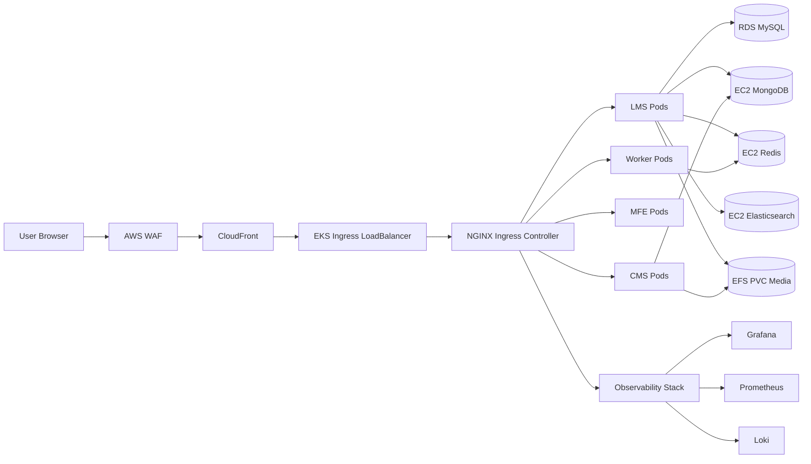
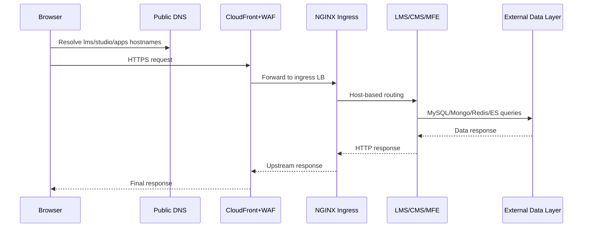

# Architecture Rationale

## Architecture Summary

- Edge security path: **AWS WAF -> CloudFront -> NGINX ingress LoadBalancer**
- Web/app path: **NGINX ingress -> LMS/CMS/MFE/Workers (EKS pods)**
- Data path: **External MySQL (RDS), MongoDB (EC2), Redis (EC2), Elasticsearch (EC2)**
- Shared media: **EFS-backed PVC** mounted by LMS/CMS
- Scaling: **HPA for LMS/CMS** with metrics-server
- Observability: **Prometheus/Grafana + Loki**

## Architecture Diagram

## Network Flow Diagram

## Core Decisions

1. **Databases external to Kubernetes**
- Meets mandatory requirement for production-style persistence and failure isolation.

2. **NGINX ingress replaces Tutor edge Caddy**
- Enforced by post-render filter at apply time.
- No direct app exposure through NodePort/LoadBalancer.

3. **Real-domain + cert-manager TLS**
- Eliminates `.local`/self-signed operational issues.
- ACME flow guarded by DNS fail-fast pre-check.

4. **Script-driven reproducibility**
- Canonical execution in `scripts/` with phase numbering.
- Legacy `infra/...` and `k8s/...` paths kept as wrappers for compatibility.

5. **Idempotent infrastructure applies**
- Terraform apply scripts import existing resources when rerun in reused AWS accounts.

## Security Controls

- EKS endpoint hardened: private access enabled, public CIDR restricted.
- DB security groups allow access only from EKS worker SG.
- TLS at ingress with Let's Encrypt certificates.
- WAF header-block rule demonstration included.
- Secrets in AWS Secrets Manager; no secrets committed to git.

## Scalability and Resilience

- LMS/CMS HPA with CPU target `70%`, min replicas `2`.
- Resource requests/limits applied before HPA to ensure metric validity.
- Readiness/liveness checks injected by deployment path.
- Data persistence validated across pod restarts.

## Operations and Backups

- RDS snapshots + EC2 volume snapshots + EBS PVC snapshots via `scripts/60-backup-run.sh`.
- Pause/resume scripts reduce runtime cost for inactive periods.
- Full cleanup available via `scripts/99-destroy-all.sh`.

## Troubleshooting Appendix

### 1) TLS cert stays pending
- Cause: DNS host does not point to current ingress LB.
- Fix: update DNS, rerun `scripts/41-real-domain-ingress-apply.sh`.

### 2) HPA shows `<unknown>`
- Cause: metrics-server not healthy.
- Fix: `scripts/12-eks-core-addons.sh`, then re-run `scripts/50-hpa-apply.sh`.

### 3) Reused-account Terraform errors (`already exists`)
- Cause: resource exists in AWS but absent in local state.
- Fix: rerun canonical apply scripts; import logic is built-in.

### 4) Intermittent DNS resolution from local workstation
- Cause: local resolver inconsistency.
- Fix: validate with authoritative NS and use `curl --resolve` as deterministic fallback during demo.
